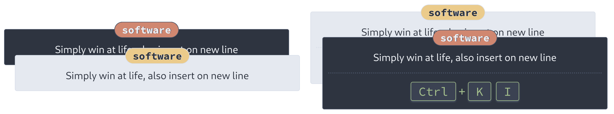

# prty-shortcut cards - Simply pretty Anki cards for keyboard shortcuts

`prty-shortcut` allows for quickly creating nice looking Anki cards for memorizing keyboard
shortcuts for different software. Shortcuts are formatted automatically, so by entering `Ctrl K` and `I`,
`prty-shortcut` will insert the format below!



## Installation

### Using demo deck

By installing the demo deck containing a few useful Firefox shortcuts, Anki will automatically
import the `prty-shortcut` note type. Simply download [this file](./demo/prty_shortcut_cards_firefox_demo.apkg)
and press <kbd>Ctrl</kbd>+<kbd>Shift</kbd>+<kbd>I</kbd> in Anki, import the file and _voilà_! The
new card type will become available!

### Manually add the note type

The note type can be also be manually created!

1. Create a new note type (<kbd>Ctrl</kbd>+<kbd>Shift</kbd>+<kbd>N</kbd> -> `Add`)
2. Select the new note type and click `Fields`
3. Make sure the note has the _exact_ following fields: `Software`, `Action`, `Key Combination` and `Extra Key Combination`. If you want to rename these, you have to change the front and back of the card.
4. Save when done and now press `Cards`
5. Copy [src/front.html](./src/front.html) into `Front Template`, [src/back.html](./src/back.html) into `Back Template` and [src/style.css](./src/style.css) into `Styles` and save
6. Done! You should now be able to create new notes of the `prty-shortcut` type!

## Usage

I would recommend playing around with the notes to figure it out, but in essence `prty-shortcut` will automatically
assume the formatting of your card. So, by entering _"Ctrl Shift P"_ in `Key Combination`, the card will be generated
as "_<kbd>Ctrl</kbd>+<kbd>Shift</kbd>+<kbd>P</kbd>"_. The plusses inserted by `prty-shortcut` means that these buttons are to be pressed simultaneously.

Some advanced shortcuts require two separate combinations. This is provided by `Extra Key Combination`, and will 
be formatted as `Shotcut Combination`. This field is not required, and will be ignored if empty.

### Using dark cards without night mode

It is possible to change the CSS (styling, i.e. [this file](/src/style.css)) of the notes so that the dark cards can be
used without night mode. To do this, simple edit the card in Anki:

<kbd>Ctrl</kbd>+<kbd>Shift</kbd>+<kbd>N</kbd>, select `prty-shortcut` and click `Cards`), go to the `Styling` section and swap place of the following lines:

```css
.card {
```

and

```css
.card.nightMode {
```

Now you will have inversed it all! If you never want the light cards, simple remove everything related to
`.card` , and remove `.nightMode` from the line containing `.card.nightMode`.

## Support

If you like this deck and would like to support the creation of more like it, don't buy me a coffee. Donate your money to those who need it most.
Personally I recommend [The GiveWell Maximum Impact Fund](https://www.givewell.org/maximum-impact-fund), where your money will make the biggest
impact on someones life.

If you instead want to help the development of Anki, consider supporting the developers of [Anki](https://github.com/ankitects/) and [AnkiDroid](https://opencollective.com/ankidroid).

If you decide to support any of these causes, please contact me! It would make my day :)

## Development

All card variants can be previewed using `examples/index.html`. Run a local webserver, using the same
directory as this `README` as root, and click your way to `examples/index.html`. To do this using python, run

```
python3 -m http.server 1337
```

to run a server on http://127.0.0.1:1337
